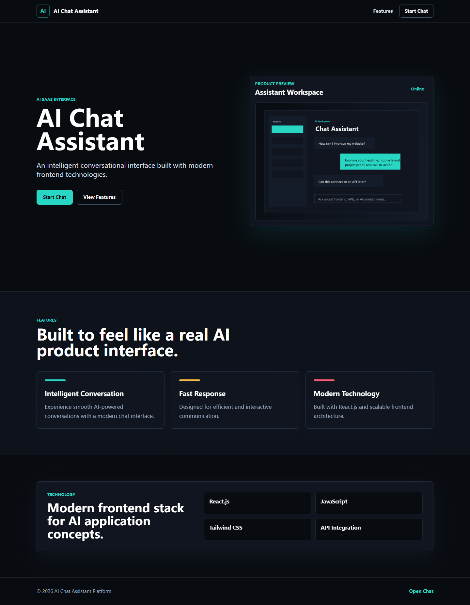
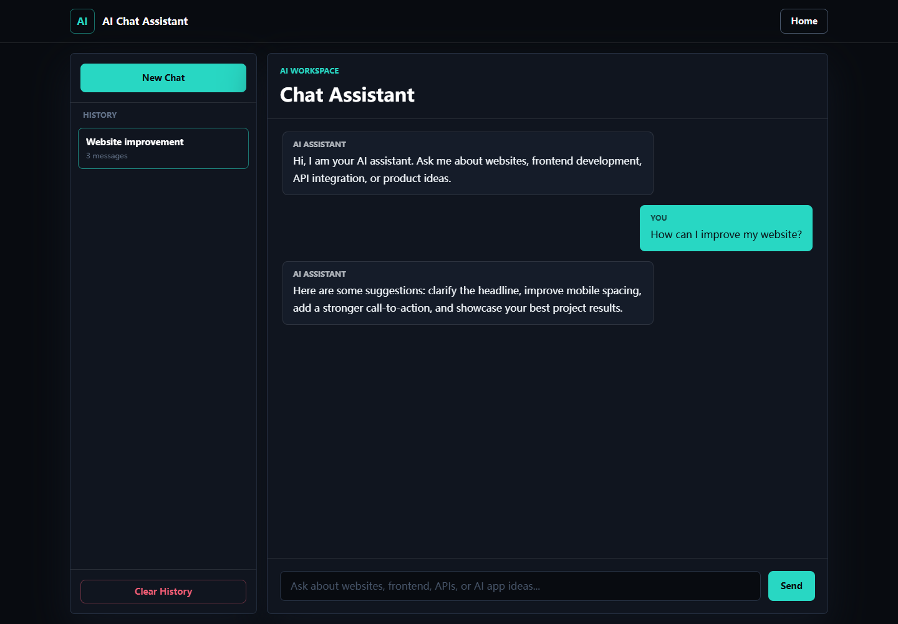
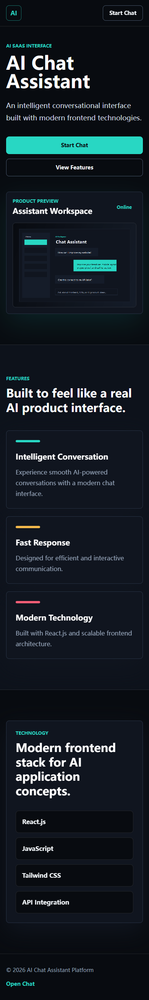

# AI Chat Assistant Platform

## English

### Overview

AI Chat Assistant Platform is a modern AI chat application interface built with React.js, JavaScript, Vite, and Tailwind CSS.

This project is designed as an Upwork portfolio project to demonstrate frontend development skills, UI implementation, responsive layout design, chat interaction logic, local chat history, and an API-ready project structure.

### Screenshots

#### Landing Page



#### Chat Interface



#### Mobile Layout



### Features

- Modern AI SaaS-style landing page
- ChatGPT-style chat interface
- User and assistant message bubbles
- Mock AI response simulation
- "AI is thinking..." loading animation
- Local Storage chat history
- New chat and clear history actions
- Responsive desktop, tablet, and mobile layouts
- Dark mode UI
- Component-based React architecture
- API integration service structure

### Technologies

- React.js
- JavaScript
- Vite
- Tailwind CSS
- React Hooks
- Local Storage

### Installation

```bash
npm install
```

### Run

```bash
npm run dev
```

### Build

```bash
npm run build
```

### Project Structure

```text
src/
+-- components/
|   +-- Navbar.jsx
|   +-- ChatWindow.jsx
|   +-- MessageBubble.jsx
|   +-- Sidebar.jsx
|   +-- FeatureCard.jsx
|   +-- Footer.jsx
+-- pages/
|   +-- Home.jsx
|   +-- Chat.jsx
+-- services/
|   +-- aiService.js
+-- App.jsx
+-- main.jsx
```

### API Integration Notes

The app currently uses a mock AI response service in `src/services/aiService.js`. The UI is structured so a real API endpoint can be connected later without changing the chat components.

---

## 中文

### 项目概述

AI Chat Assistant Platform 是一个使用 React.js、JavaScript、Vite 和 Tailwind CSS 构建的现代 AI 聊天助手 Web 应用界面。

该项目定位为 Upwork 作品集项目，用于展示前端开发能力、UI 实现能力、响应式布局、聊天交互逻辑、本地聊天记录保存，以及后续接入真实 AI API 的项目结构。

### 项目截图

#### 首页


#### 聊天界面


#### 移动端布局


### 功能特点

- 现代 AI SaaS 风格首页
- ChatGPT 风格聊天界面
- 用户消息和 AI 消息气泡
- Mock AI 回复模拟
- "AI is thinking..." 加载动画
- Local Storage 本地聊天历史
- 新建聊天和清空历史功能
- 桌面端、平板端、移动端响应式布局
- 深色主题界面
- React 组件化架构
- 预留 API 接入服务结构

### 使用技术

- React.js
- JavaScript
- Vite
- Tailwind CSS
- React Hooks
- Local Storage

### 安装依赖

```bash
npm install
```

### 本地运行

```bash
npm run dev
```

### 打包构建

```bash
npm run build
```

### 项目结构

```text
src/
+-- components/
|   +-- Navbar.jsx
|   +-- ChatWindow.jsx
|   +-- MessageBubble.jsx
|   +-- Sidebar.jsx
|   +-- FeatureCard.jsx
|   +-- Footer.jsx
+-- pages/
|   +-- Home.jsx
|   +-- Chat.jsx
+-- services/
|   +-- aiService.js
+-- App.jsx
+-- main.jsx
```

### API 接入说明

当前项目使用 `src/services/aiService.js` 中的 Mock AI 回复服务。项目已经预留服务层结构，后续可以接入真实 AI API，而不需要重写聊天界面组件。
